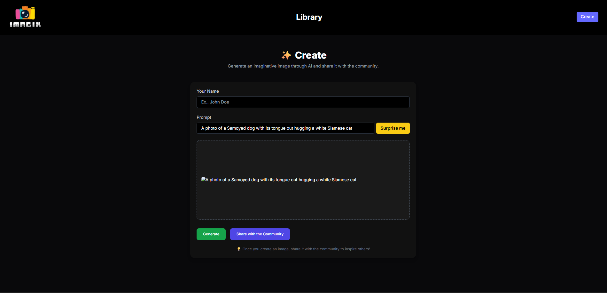

# 📸 Imagix – AI Image Generator

Imagix is a full-stack AI-powered image generation web application.  
Users can generate creative images from text prompts using **OpenAI’s DALL·E API**, share them with the community, and explore other creations.

---

## 🚀 Features
- ✨ Generate AI-powered images from text prompts  
- 🎨 Surprise Me button to get random creative prompts  
- 📤 Share images with the community  
- 🔍 Browse & search community posts  
- 🌓 Dark UI with modern styling (Tailwind CSS)  

---

## 🛠️ Tech Stack
### Frontend
- React.js
- Vite
- Tailwind CSS

### Backend
- Node.js
- Express.js
- MongoDB

### APIs
- OpenAI DALL·E API

---

## 📂 Project Structure
Imagix/
│── client/ # React frontend
│── server/ # Node.js + Express backend
│── .env # Environment variables (API keys, DB URI)
│── package.json
│── README.md

yaml
Copy code

---

## ⚙️ Installation & Setup

### 1️⃣ Clone the repo

git clone https://github.com/txnishq28/AI-Image-generator.git
cd AI-Image-generator
2️⃣ Install dependencies
Backend

Copy code
cd server
npm install
Frontend

Copy code
cd ../client
npm install
3️⃣ Setup environment variables
Create a .env file inside the server folder:

env
Copy code
OPENAI_API_KEY=your_openai_api_key
MONGODB_URI=your_mongodb_connection_string
⚠️ Important: Never commit .env to GitHub.

4️⃣ Run the project
Backend

Copy code
cd server
npm start
Frontend

Copy code
cd client
npm run dev
📸 Usage
Enter your name & text prompt.

Click Generate to create an AI image.

Save or Share with the Community.

Explore other posts in the Library.

🔒 Security
API keys are stored in .env and ignored via .gitignore.

Always regenerate your OpenAI API key if exposed.

📜 License
This project is licensed under the MIT License.

🙌 Acknowledgements
OpenAI for the DALL·E API

MongoDB for database

Tailwind CSS for UI styling

---

👉 This README will look great on GitHub with **icons, sections, and instructions**.  

Do you also want me to include **deployment steps (Vercel for frontend + Render for backend)** so others can run it online?